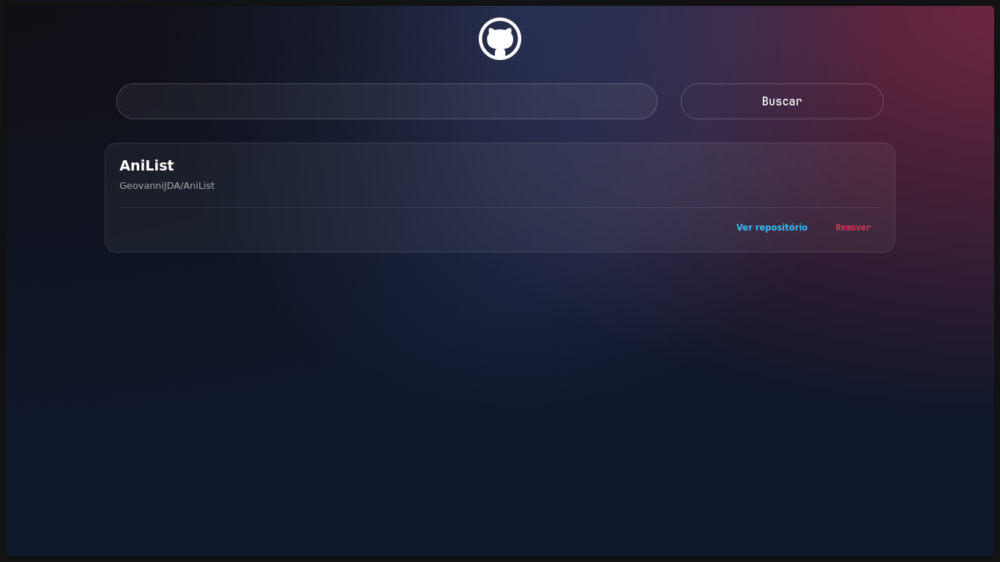

<!-- Substitua o caminho abaixo por sua screenshot real após gerar/exportar.  -->
<p align="center">
  
</p>

# GitHub Wiki

## Visão Geral do Projeto

O **GitHub Wiki** é uma aplicação front-end desenvolvida em React que oferece uma interface funcional para interação com a API pública do GitHub. Seu objetivo principal é facilitar a busca, organização e o armazenamento de repositórios favoritos por meio de uma lista local dinâmica. A aplicação resolve o desafio da gestão e acesso rápido a múltiplos repositórios de interesse, eliminando a dispersão de links e tornando o acompanhamento eficiente.

## 🚀 Funcionalidades Principais

- **Integração com API**  
  Consome dados diretamente da API REST do GitHub utilizando a biblioteca Axios, permitindo consultas em tempo real de repositórios.

- **Gerenciamento de Repositórios**  
  Permite a busca de repositórios pelo formato "Usuário/NomeDoRepositório". Usuários podem adicionar, visualizar e remover repositórios da lista favorita sem recarregar a página.

- **Gerenciamento de Estado Dinâmico**  
  Todos os dados da lista de favoritos são mantidos e atualizados em tempo real utilizando o estado do React (Hooks), garantindo uma experiência fluida.

- **Acesso Direto**  
  Cada item adicionado oferece link direto para o repositório correspondente no GitHub, otimizando a navegação do usuário.

- **Tratamento de Erros**  
  Implementação de mecanismos para informar buscas inválidas, prevenindo duplicatas e exibindo mensagens de feedback claras para o usuário (caso implementado no código).

## 🛠 Tecnologias Utilizadas

- **React.js:** Componentes funcionais, uso intensivo de Hooks (`useState`, `useEffect`).
- **Axios:** Cliente HTTP para integração com a API do GitHub.
- **Styled-components:** Estilização baseada em componentes, com fácil manutenção e personalização de temas.
- **Ferramentas de Build:** Create React App (CRA) e Webpack para bundling, Babel para transpile do JS moderno.

## 🎨 Interface

Interface temática **Deep Nebula** (Glassmorphism), layout responsivo utilizando unidades `rem` e princípios modernos de UX para uma navegação agradável em qualquer dispositivo.

## ⚡ Como Começar

### Pré-requisitos

- Node.js (>= 14.x recomendado)
- npm ou yarn

### Instalação

```bash
git clone https://github.com/GeovanniJDA/github-wiki.git
cd github-wiki
npm install
npm start
```
_Ou, se preferir, utilize `yarn install` e `yarn start`._

## 📁 Estrutura do Projeto

- **components/**
  - **Input:** Campo de entrada controlado para busca de repositórios.
  - **Button:** Botão reutilizável para submissão ou ações diversas.
  - **ItemRepo:** Componente que exibe os detalhes de cada repositório salvo, incluindo link direto para o GitHub e botão de remoção.

Os componentes são desacoplados e organizados para facilitar expansão, manutenção e testabilidade do código.

---

> Para dúvidas ou sugestões, utilize o sistema de Issues do repositório.
